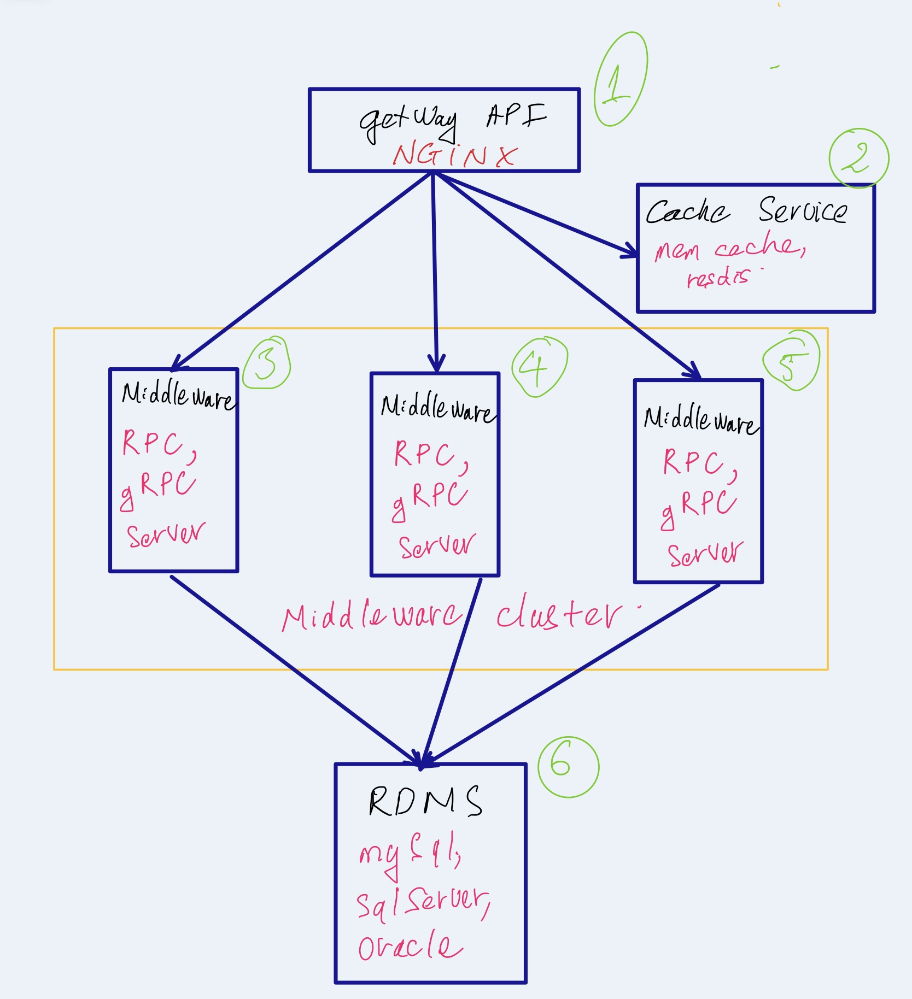

# Task 2[System architecture design]
Design a system for selling products
#
## Statement:
We are going to develop a commercial website for selling products where:
-	Each product has a number of available items in stock.
-	The system should be able to process at least N = 6000 concurrent requests for viewing or purchasing products.
-	The system is only allowed to have at most S = 6 servers, where up to 3 servers can be used as relational databases.
-	One relational database can serve at most C = 300 concurrent connections.
-	The system must: (main requirements)
-	ensure data consistency, which means that there will be never such a case where the number of successful purchased items is more than the number of available items in stock.
-	provide real-time feedback to its users with the lowest possible latency. 
-	It will be good to: (bonus requirements)
-	have the highest availability with no point of failure.
-	be easily scalable in the future when the number of products and users increase.

Requirement:
-	Design (draw) the high level architecture of the system.
-	Describe what technologies you will use to develop the system.
-	Explain in detail how the system works, and how it meets all the listed requirements.
-	Note that you must design and analyze base on numbers (N, C, S) provided in the statement.

## High level architecture of the system.


## Describe architecture
With high level architecture previous section. We have 4 main component below:
- 1 getway API server (1).
- 1 cache service (2).
- 3 servers can be used as relational databases I call `middleware cluster` (3)(4)(5).
- 1 server is relational databases server (6).

## How it work and what technologies used
- (1) getway API is webservice provide endpoint for webclient. Technologies can be use Golang with [`echo framwork`](https://echo.labstack.com/), Node.js with [`express framwork`](https://expressjs.com/) ... server is `NGINX server` or `Apache server` ... any server can be config load balancing call to `middleware cluster` through RPC protocol.
- (2) cache service use store viewing products for reduce metric request call `middleware cluster`. Technologies can use any open source example memcached, redis ....
- (3)(4)(5) `middleware cluster` handle transaction purchasing products or viewing request. Technologies use RPC protocol `apache thrift`, `protocol buffer`. ORM framework or native `sql-driver`. Language use high performance language like `Java, Golang` ...

- (6) `RDBMS (relational database management system`. Technologies use any.example: `mySql, Sql server`. with `mySql` use `innodb engine` for lock row transaction. `Sql server` set isolation levels `REPEATABLE READ` read more [here](https://docs.microsoft.com/en-us/sql/connect/jdbc/understanding-isolation-levels?view=sql-server-ver15).

### How it work.
-   getway API. viewing product get cache first if absent read `middleware cluster` through RPC. Why I use RPC protocol here because:
    -   High performance. (My experience use apache thrift with nonblocking server can be hanlde 45k reqs/s).
    -   Straightforward and simple interaction.
    -   Easy-to-add functions. 

    It has some limit not `perfectly`
    -   Tight coupling to the underlying system.
    -   Low discoverability.
    -   Function explosion.

    Read more at [here](https://levelup.gitconnected.com/comparing-api-architectural-styles-soap-vs-rest-vs-graphql-vs-rpc-84a3720adefa)

- `RDBMS` ensure data consistency. example use mysql with `innodb engine` for lock row. This is simple transaction
```sql
begin tran
    DECLARE n INT DEFAULT 0;
    SELECT num_item INTO n from product where pro_id=@pid FOR UPDATE; /* lock row */
    n -= num_purchase
    UPDATE product SET num_item=n where pro_id=@pid
    if ERROR
        ROLLBACK
end tran
```

## Concludes
-   With this design ensure data consistency(`RDBMS`), provide real-time feedback to its users with the lowest possible latency (`RPC protocol` faster `http protocol`.). 
-   Easily scalable, grow server at `middleware cluster`

## Reference
-   http://newsletter.grokking.org/
-   https://levelup.gitconnected.com/comparing-api-architectural-styles-soap-vs-rest-vs-graphql-vs-rpc-84a3720adefa
-   https://www.bugsnag.com/blog/grpc-and-microservices-architecture
-   https://www.slideshare.net/longdao/zing-database
-   https://github.com/apache/thrift

THANKS FOR READING =)).
